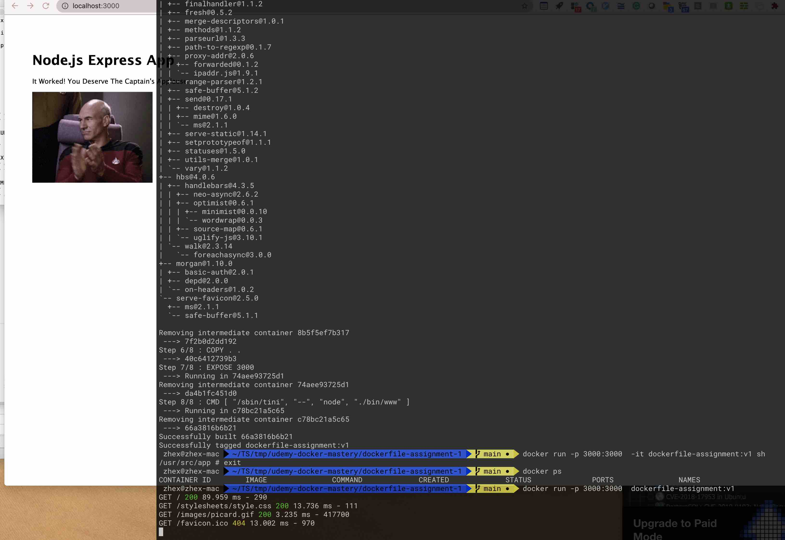

## Path
 ~/TS/tmp/udemy-docker-mastery/dockerfile-assignment-1

## Build and Run
```sh
docker image build . -t dockerfile-assignment:v1
docker run -p 3000:3000  dockerfile-assignment:v1
```
## Submit image to docker hub
```sh
docker image tag dockerfile-assignment:v1 xuzhepku/dockerfile-assignment-1
#Testing
docker run -p 3000:3000 --rm xuzhepku/dockerfile-assignment-1
```

